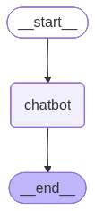

# Langgraph Tutorial

Table Of Content:
* [Description](#Description)
* [Configure](#Configure)
* [Develop](#Develop)
* [01 - Basic Chatbot](#01-BasicChatbot)


<a id="Description"></a>
## Description
 
List of all [Langgraph](https://www.langchain.com/langgraph) Tutorial on the official website.

<a id="Confiure"></a>
## Configure

Please make sure to make a local copy of this git repo.
```
> git clone https://github.com/akashatek/Langgraph-Tutorial
> cd Langgraph-Tutorial
```

Copy your local file **example.env** into a new secret file **.env**.  
And update the variables as follow.
```
# OPENAI
OPENAI_API_KEY=...

# TAVILY
TAVILY_API_KEY=...
```

<a id="Develop"></a>
## Develop

Install your development environment
```
> python -m venv .venv
> source .venv/bin/activate
> pip install --upgrade pip

# if requirement.txt exists
> pip install -r requirements.txt

# if not
> pip install dotenv langgraph langchain-openai langchain-tavily
> pip freeze > requirements.txt
```

Run your python application.
```
> python -O <application name>.py
``` 

<a id="01-BasicChatbot"></a>
## 01 - Basic Chatbot

Reference: [Build a basic chatbot](https://langchain-ai.github.io/langgraph/tutorials/get-started/1-build-basic-chatbot/)

Run the agent.
```
> python -O 01-basic-chatbot.py
Successfully saved the graph to ./01-basic-chatbot.png
> User: who are you?

Assistant: I am ChatGPT, a large language model created by OpenAI. I'm here to answer your questions, have conversations, and help with tasks like writing, research, learning new things, or just chatting. If you need assistance or want to know more, just ask!
```
Agent Graph



<a id="02-AddTools"></a>
## 02 - Add Tools

Reference: [Add tools](https://langchain-ai.github.io/langgraph/tutorials/get-started/2-add-tools/)

Run the agent either **02-add-tools.py** or alternatively **02-add-tools-prebuilts.py**
```
> python -O 02-add-tools.py
Successfully saved the graph to 02-add-tools.png
> User: list all your tools
Assistant: Here are the tools I currently have access to:

1. Web Search (functions.tavily_search):  
 - I can search the web for up-to-date, comprehensive, and trusted information on a wide range of topics.  
 - This tool allows for advanced filtering (by domain, time period, topic, and more) and can include images or favicons if required.

2. Multi-tool Use (multi_tool_use.parallel):  
 - This lets me run multiple tools simultaneously (in parallel), allowing for faster and broader results when you have complex or multi-part questions.

Let me know if you want more details about how any tool works, or if you have a specific request to try out!
```

Agent Graph

